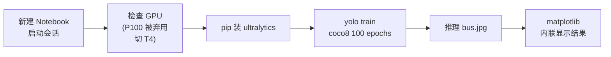

# Kaggle 免费 GPU 跑 YOLO26 官方 demo 实操记录（2026-08-08）

> 目标：在 Kaggle 免费 GPU 上跑通 Ultralytics YOLO26 官方快速入门（coco8 迷你数据集，100 epochs）。
> 结果：全流程跑通。训练仅 3~5 分钟，最终 mAP50=90.4%；`bus.jpg` 推理检出 4 人 + 1 巴士（最高置信度 0.92）。全程约 5~8 分钟。
> 本文按实际操作顺序记录，可直接照做。

---

## 一、整体思路



**和上次 ResNet 记录的最大区别**：YOLO26 官方 demo 用 `coco8.yaml` 迷你数据集（自带、自动下载），**不需要本地数据、不需要 GitHub 中转**，4 个 cell 直接开跑。

---

## 二、踩坑第一步：P100 用不了，必须切 T4

### 现象

运行 `torch.cuda.get_device_name(0)` 返回 `Tesla P100-PCIE-16GB`，但伴随一串警告：

```
Found GPU0 Tesla P100-PCIE-16GB which is of cuda capability 6.0.
Minimum and Maximum cuda capability supported by this version of PyTorch is (7.0) - (12.0)
Tesla P100-PCIE-16GB with CUDA capability sm_60 is not compatible with the current PyTorch installation.
```

### 原因

Kaggle 预装 PyTorch `2.10.0+cu128` 最低支持 sm_70（Volta 及以上），而 **P100 是 Pascal sm_60，已被新版 PyTorch 淘汰**。`is_available()` 返回 True 只是驱动层面，实际跑 CUDA 运算必崩。

### 解决

右上角菜单 → **Settings → Accelerator → 选 GPU T4**，保存后重启会话。T4 是 Turing sm_75，完全在支持范围内，切完无警告。

| GPU | 架构 | CUDA 算力 | PyTorch 2.10.0+cu128 |
|---|---|---|---|
| P100 | Pascal | sm_60 | ❌ 不支持（最低 sm_70） |
| **T4** | Turing | sm_75 | ✅ 支持 |

> 别去降级 PyTorch 适配 P100：要卸装 torch 重装旧版，费时且和 ultralytics 新版可能有兼容问题，换 GPU 是零成本方案。

---

## 三、完整命令（4 个 cell）

### Cell 1 · 验证 GPU（Python cell）

```python
import torch
print("CUDA 可用:", torch.cuda.is_available())
print("GPU 型号:", torch.cuda.get_device_name(0))
print("显存:", round(torch.cuda.get_device_properties(0).total_memory / 1024**3, 1), "GB")
print("PyTorch:", torch.__version__)
```

预期：`CUDA 可用: True` / `GPU 型号: Tesla T4` / `显存: 15.8 GB` / `PyTorch: 2.10.0+cu128`，**无警告**。

### Cell 2 · 装包 + 训练（`%%bash`，前台跑完直接看进度）

```bash
%%bash
pip install -q ultralytics
cd /kaggle/working
yolo train data=coco8.yaml model=yolo26n.pt epochs=100 imgsz=640 device=0
```

- 首次运行自动下载 `yolo26n.pt` 权重（~6MB）和 coco8 数据集（几张图，无需中转）；
- coco8 只有 4 张训练图，T4 上 100 epochs 约 **3~5 分钟**；
- 结束时自动验证，最后输出 val 表格 + `Results saved to /kaggle/working/runs/detect/train`。

### Cell 3 · 推理验证（Python cell）

```python
from ultralytics import YOLO
model = YOLO("/kaggle/working/runs/detect/train/weights/best.pt")
model.predict("https://ultralytics.com/images/bus.jpg", save=True)
print("完成，结果在 runs/detect/predict/")
```

预期输出：`image 1/1 ... 4 persons, 1 bus, 9.9ms` + `Results saved to /kaggle/working/runs/detect/predict`。

### Cell 4 · notebook 内联显示结果（Python cell）

```python
import matplotlib.pyplot as plt
import matplotlib.image as mpimg

img = mpimg.imread("/kaggle/working/runs/detect/predict/bus.jpg")
plt.figure(figsize=(10, 8))
plt.imshow(img)
plt.axis('off')
plt.show()
```

---

## 四、实测数据（2026-08-08）

### 环境

| 项 | 值 |
|---|---|
| GPU | Tesla T4（15.8GB） |
| PyTorch | 2.10.0+cu128 |
| ultralytics | 最新版（pip 安装） |
| 数据集 | coco8（4 训练图 / 4 验证图） |

### 验证指标（coco8 val，100 epochs）

| 类别 | Images | Instances | P | R | mAP50 | mAP50-95 |
|---|---|---|---|---|---|---|
| **all** | 4 | 17 | 0.901 | 0.652 | **0.904** | **0.667** |
| person | 3 | 10 | 1.0 | 0.413 | 0.784 | 0.397 |
| dog | 1 | 1 | 0.744 | 1.0 | 0.995 | 0.597 |
| horse | 1 | 2 | 0.826 | 1.0 | 0.995 | 0.795 |
| elephant | 1 | 2 | 0.838 | 0.5 | 0.662 | 0.425 |
| umbrella | 1 | 1 | 1.0 | 1.0 | 0.995 | 0.895 |
| potted plant | 1 | 1 | 1.0 | 0.0 | 0.995 | 0.895 |

> 数据仅 4 张图 17 个框，指标仅供参考；`person` recall 低是因图中人多且互相遮挡。

### 推理实测（bus.jpg，640×480）

- 检测结果：**bus 0.92** + person 0.71 / 0.87 / 0.9 / 0.91
- 单张推理：**9.9ms**（preprocess 25.9ms / inference 9.9ms / postprocess 0.9ms）

---

## 五、踩坑清单（按遇到顺序）

1. **Kaggle 免费 GPU 可能分配 P100**：sm_60 被 PyTorch 2.10 淘汰（最低 sm_70），`torch.cuda.is_available()` 为 True 但实际无法运行 → Settings → Accelerator 切 **T4**。
2. **推理结果不会自动显示**：`predict(save=True)` 只存文件、输出文字日志，图片不会弹出 → 用 `matplotlib` 或 `IPython.display.Image` 内联展示。
3. **coco8 指标别当真**：迷你数据集（4 张验证图），mAP 只是"能跑通"的证明，不代表真实泛化能力。

---

## 六、产物

- 训练权重：`/kaggle/working/runs/detect/train/weights/best.pt`（后续迁移/部署用）
- 检测结果图：`/kaggle/working/runs/detect/predict/bus.jpg`
- 左侧文件列表右键即可下载；Kaggle 会话约 12 小时回收，建议训完尽快下载。